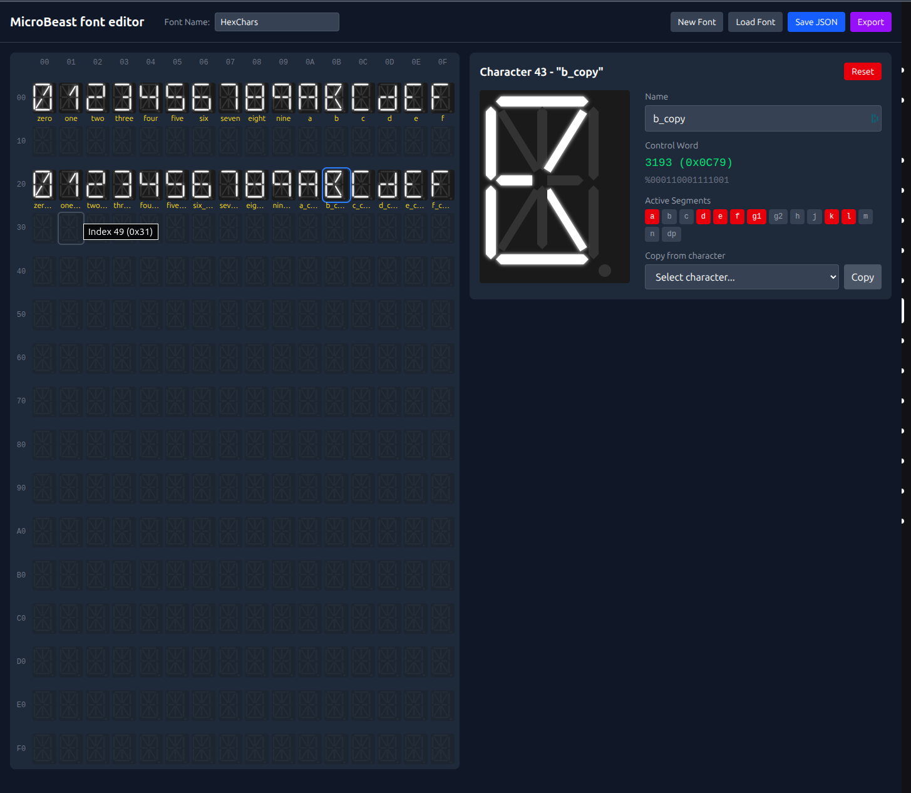
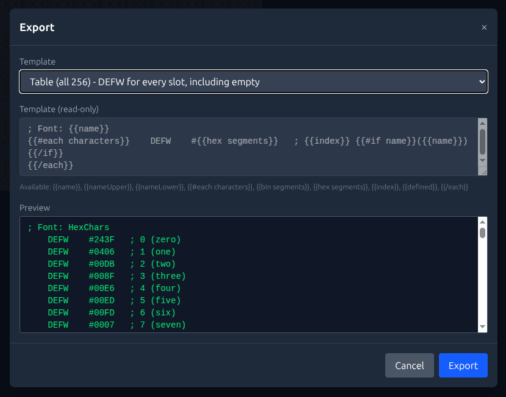

# MicroBeast Font Editor

A browser-based editor for creating 14-segment LED display fonts for the [FeerSum Beasts MicroBeast Z80 Computer](https://feersumbeasts.com/microbeast.html). Design characters by toggling individual segments, organize them in a 256-slot grid, and export to various formats for use in embedded systems.



## Getting Started

```bash
npm install
npm run dev
```

Open <http://localhost:5173> in your browser.

### Deployment

This project includes a GitHub Actions workflow that automatically deploys to GitHub Pages when you push to the `main` or `master` branch. To enable it:

1. Go to your repository's Settings > Pages
2. Under "Build and deployment", select "GitHub Actions" as the source

## Using the Editor

### The Character Grid

The main grid displays all 256 character slots (0x00-0xFF) arranged in a 16x16 layout. Each cell shows a miniature 14-segment display preview.

- **Empty cells** appear dimmed and show a blank display
- **Defined characters** show their segment pattern and optional name
- Row and column headers show hexadecimal indices (00-0F)

### Selecting Characters

| Action | Result |
|--------|--------|
| Click | Select single character (creates blank if empty) |
| Shift+Click | Select range from last click to current |
| Ctrl/Cmd+Click | Toggle character in selection |

The **anchor** (primary selection) has a thicker blue ring and is shown in the editor panel. Other selected characters have a thinner ring.

### Editing Characters

Click any cell to select it and open it in the editor panel on the right:

1. **Segment Display**: Click individual segments to toggle them on/off
2. **Character Name**: Optional label displayed in the grid and available in exports
3. **Copy From**: Duplicate segments from another character (by hex index)
4. **Reset**: Clear all segments back to off

If you click away from a character that has no segments and no name, it automatically reverts to an empty slot.

### Moving and Copying Characters

**Drag and drop** to move characters:

- Drag a single character to relocate it
- Select multiple characters, then drag any selected one to move them all
- Selected characters maintain their relative positions

**Ctrl/Cmd+Drag** to copy instead of move.

### Keyboard Shortcuts

| Shortcut | Action |
|----------|--------|
| Arrow keys | Navigate the grid |
| Shift+Arrow | Extend selection in that direction |
| Ctrl/Cmd+A | Select all defined characters |
| Ctrl/Cmd+C | Copy selected characters |
| Ctrl/Cmd+V | Paste at anchor position |
| Delete / Backspace | Reset selected characters (clear all segments) |

### Saving and Loading

- **Save JSON**: Downloads the font as a `.json` file (can be loaded later)
- **Load Font**: Opens a previously saved `.json` font file
- **New Font**: Clears the grid and starts fresh

## Exporting Fonts

Click **Export** to open the export dialog. Choose from built-in presets or create a custom template.



### Built-in Presets

| Preset | Description | Extension |
|--------|-------------|-----------|
| Symbols (defined only) | Assembly EQU for each defined character | .asm |
| Table (all 256) | Assembly DEFW for every slot | .asm |
| C Header | C header with uint16_t array | .h |

### Writing Custom Templates

Templates use [Handlebars](https://handlebarsjs.com/) syntax. Select "Custom template..." from the dropdown to edit.

#### Available Variables

| Variable | Description |
|----------|-------------|
| `{{name}}` | Font name as entered |
| `{{nameUpper}}` | Font name in UPPER_SNAKE_CASE |
| `{{nameLower}}` | Font name in lower_snake_case |
| `{{#each characters}}` | Loop over all 256 character slots |

#### Inside the `{{#each characters}}` Loop

| Variable | Description |
|----------|-------------|
| `{{index}}` | Character index (0-255) |
| `{{defined}}` | Boolean: true if character exists |
| `{{segments}}` | Raw segment bitmask (0-32767) |
| `{{name}}` | Character name or auto-generated `CHAR_XX` |
| `{{bin segments}}` | Segments as 15-digit binary (e.g., `000000001111111`) |
| `{{hex segments}}` | Segments as 4-digit hex (e.g., `007F`) |

#### Conditionals

```handlebars
{{#if defined}}
  ...only for defined characters...
{{else}}
  ...only for empty slots...
{{/if}}
```

#### Example: Assembly Symbols

```handlebars
; Font: {{name}}
{{#each characters}}
{{#if defined}}
{{name}} EQU %{{bin segments}} ; 0x{{hex segments}}
{{/if}}
{{/each}}
```

#### Example: C Array

```handlebars
#include <stdint.h>

const uint16_t font_{{nameLower}}[] = {
{{#each characters}}
    0x{{hex segments}},  // {{index}}{{#if defined}}: {{name}}{{/if}}
{{/each}}
};
```

#### Example: JSON Export

```handlebars
{
  "name": "{{name}}",
  "characters": [
{{#each characters}}
    { "index": {{index}}, "segments": {{segments}}, "defined": {{defined}} }{{#unless @last}},{{/unless}}
{{/each}}
  ]
}
```

### Custom File Extension

When using a custom template, you can specify the file extension for the downloaded file (defaults to `.txt`).

## Segment Layout

The 14-segment display uses the following bit mapping (bit 0 = LSB):

```
     ──0──   ──1──
    |\    |     /|
    7  9  8  10  2
    |    \|/     |
     ──6──   ──11─
    |    /|\     |
    5. 13 12 14  3
    |/    |     \|
     ──4──   ──3──
                   [] 15
```

Bit 15 is the decimal point (bottom right).

## File Format

Fonts are saved as JSON:

```json
{
  "name": "My Font",
  "characters": [
    null,
    { "segments": 1234, "name": "A" },
    { "segments": 5678, "name": null },
    null,
    ...
  ]
}
```

- `characters` is always a 256-element array
- `null` entries represent empty/undefined slots
- `segments` is a 16-bit integer bitmask
- `name` is optional (can be `null`)
